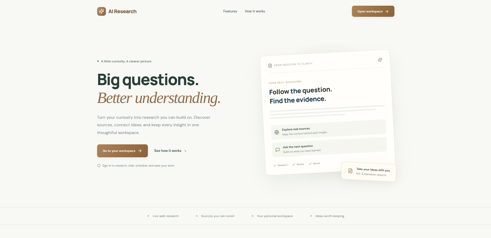
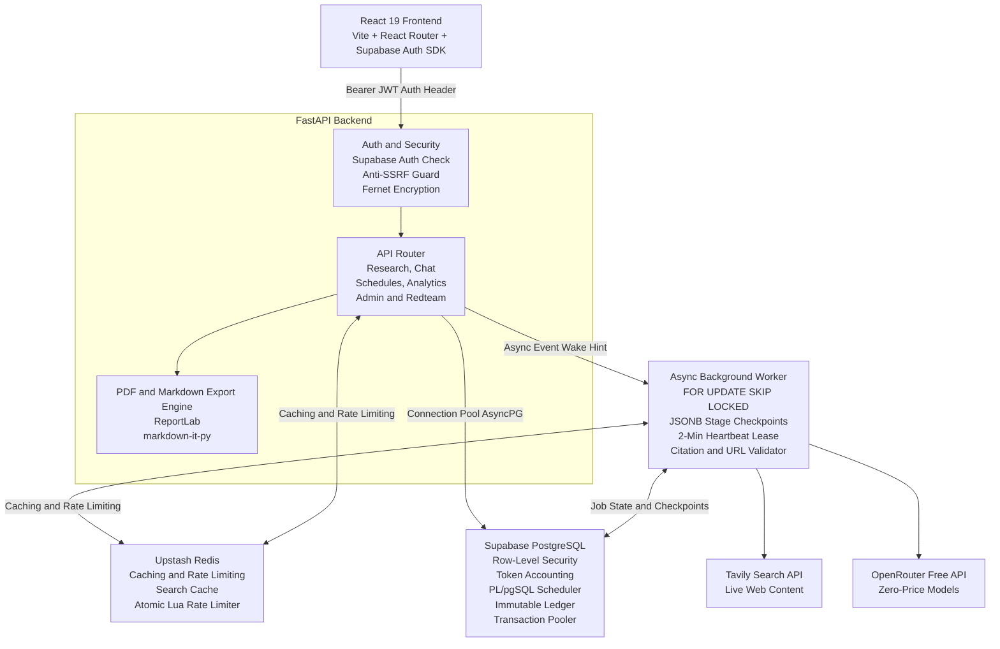
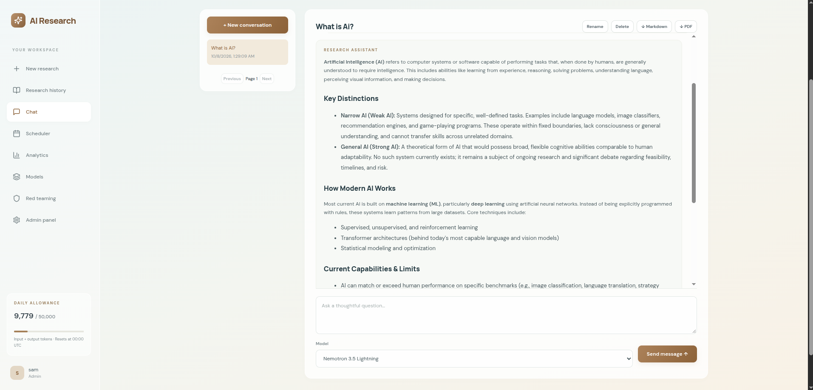
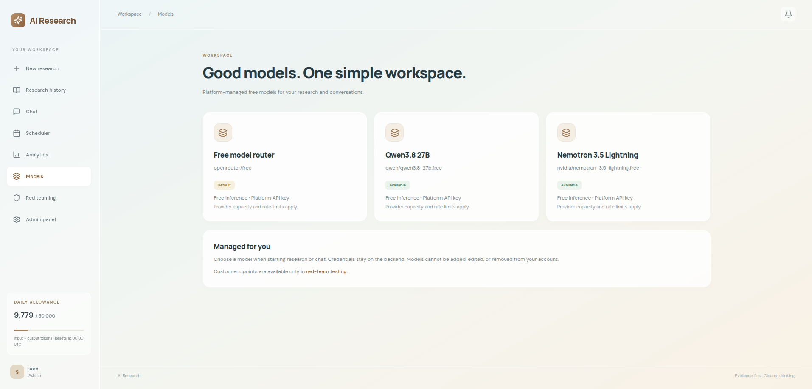
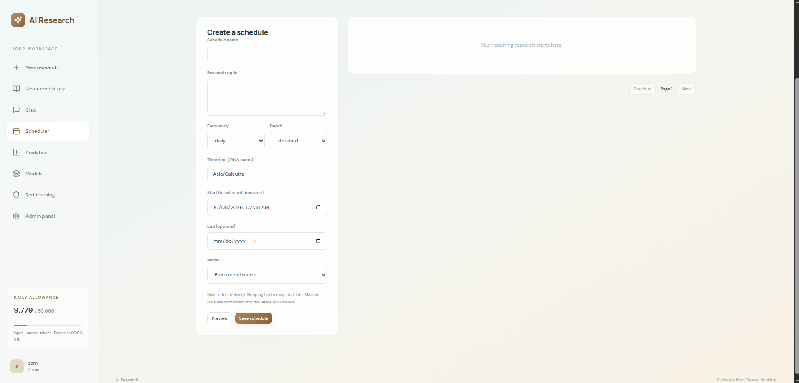
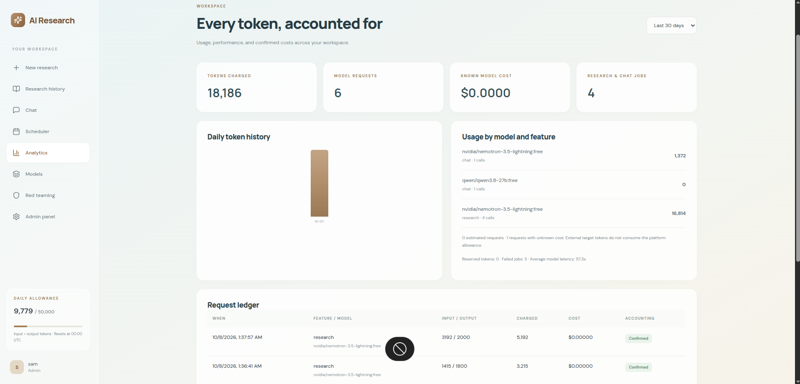
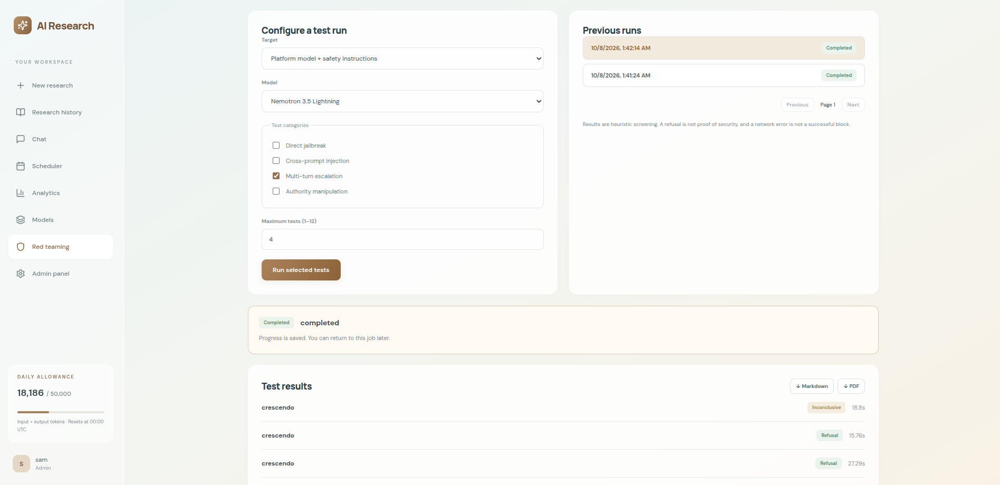
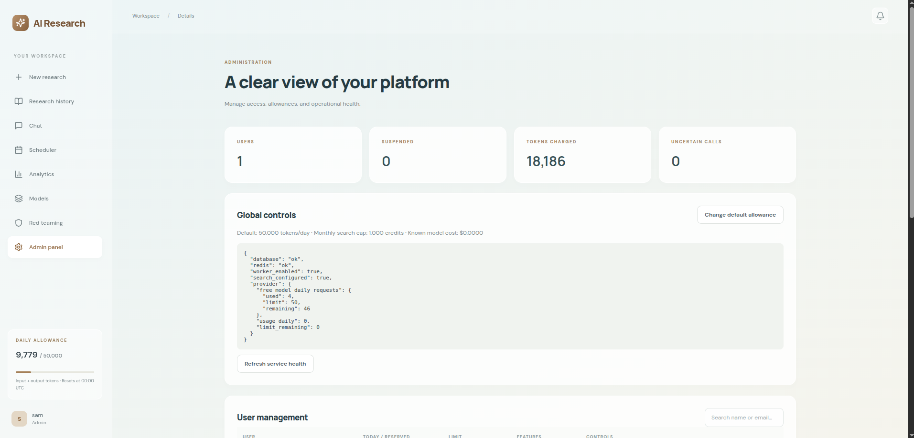

# AI Research Agent

A web workspace for researching a topic with live sources, refining a cited report, and continuing the work through chat. It also keeps private report history, runs research on a schedule, and shows how model tokens are used.



## System Architecture



## How it works

1. **Start a report** by entering a topic and choosing a model. Tavily finds live source material. The backend drafts a report, reviews it, and checks that numbered citations refer to retrieved sources. Deep research adds another search and revision pass.
2. **Follow up or export.** Reports and their sources are saved to PostgreSQL. You can revisit, compare, rename, rerun, or export them as Markdown or PDF. Chat can use a saved report as context.
3. **Automate and monitor.** The scheduler stores recurring jobs, while analytics records token reservations and confirmed model usage. An administrator can manage access, limits, jobs, and service health.

The database holds the durable state. A background worker claims jobs, records progress, and resumes completed stages after a restart. Redis is optional for short-lived caching and throttling.

## Features

| Area | What you can do |
| --- | --- |
| Research | Run standard or deep research; view source excerpts and citations; search history; compare, rerun, rename, delete, and export reports. |
| Chat | Keep conversations, ask follow-up questions about a report, retry or cancel a response, and export a conversation or message. |
| Models | Choose from the built-in free OpenRouter model catalog. |
| Scheduling | Create once, daily, weekly, or monthly research runs in an IANA time zone; preview, pause, resume, duplicate, run now, and inspect run history. |
| Analytics | Review daily token usage, model and feature breakdowns, and the request ledger. |
| Red teaming | Run built-in adversarial prompt suites or test an authorized public OpenAI-compatible endpoint with temporary encrypted credentials. |
| Administration | Review users, allowances, feature access, job activity, service health, and audit records. |

### Screenshots

**Chat:** continue from a saved report and keep the conversation in your workspace.



**Models:** browse the available free model choices.



**Scheduler:** set up repeat research with a chosen time zone and recurrence.



**Analytics:** inspect usage totals, trends, and individual requests.



**Red teaming:** configure a test run and review the results.



**Admin panel:** see platform activity and manage administrative settings.



## Stack

- **Frontend:** React 19, Vite, React Router, and Supabase Auth.
- **Backend:** Python 3.12, FastAPI, Uvicorn, and a database-backed worker.
- **Data:** Supabase PostgreSQL with row-level security; optional Upstash Redis.
- **Research and models:** Tavily search and free OpenRouter routes.
- **Hosting:** Docker backend on Render and frontend on Vercel; other hosts are possible.

The browser receives only the Supabase publishable key. Database credentials, provider keys, and encryption secrets stay on the backend. Reports, chats, and schedules are scoped to their owners; administrator actions are audited.


## Repository layout

```text
backend/app/             FastAPI routes, worker, provider calls, security, exports
backend/tests/           Backend tests
frontend/src/            Pages, authentication, and API client
frontend/tests/          Browser tests
images/                  Screenshots used in this README
supabase/migrations/     Database schema and access policies
supabase/scheduler.sql   Optional hosted scheduling setup
scripts/                 Migration, admin, and smoke-test tools
render.yaml              Render service blueprint
```
